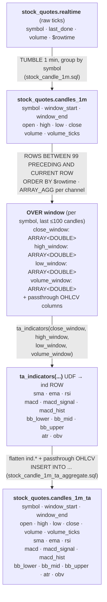
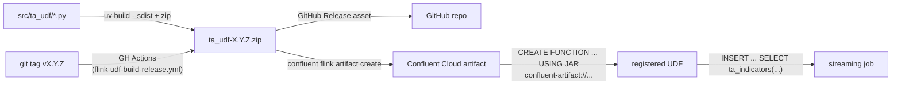

# Technical-Indicators Pipeline — Design

Goal: enrich each 1-minute stock candle with technical indicators (RSI, MACD,
Bollinger Bands, ATR, OBV, SMA, EMA) computed over a trailing window of up to
100 candles, in real time on **Confluent Cloud for Apache Flink**, using a
Python UDF backed by [`pandas-ta-classic`](https://github.com/xgboosted/pandas-ta-classic).

## Data flow



Same flow as ASCII (renders anywhere):

```text
┌─────────────────────────────────────────────┐
│ stock_quotes.realtime              (raw ticks)│
│ symbol · last_done · volume · $rowtime        │
└───────────────────────┬───────────────────────┘
                        │  TUMBLE 1 min, GROUP BY symbol   (stock_candle_1m.sql)
                        ▼
┌─────────────────────────────────────────────┐
│ stock_quotes.candles_1m                       │
│ symbol · window_start · window_end            │
│ open · high · low · close                     │
│ volume · volume_ticks                         │
└───────────────────────┬───────────────────────┘
                        │  OVER (PARTITION BY symbol ORDER BY $rowtime
                        │        ROWS BETWEEN 99 PRECEDING AND CURRENT ROW)
                        │  ARRAY_AGG per channel
                        ▼
┌─────────────────────────────────────────────┐
│ OVER-window row  (per candle, frame ≤100)     │
│ symbol · window_start · window_end            │
│ open · high · low · close · volume · ticks    │
│ close_window[]  · high_window[]               │
│ low_window[]    · volume_window[]             │
└───────────────────────┬───────────────────────┘
                        │  ta_indicators(close_window, high_window,
                        │                low_window, volume_window)
                        ▼
┌─────────────────────────────────────────────┐
│ ind  ROW<…>   (indicators for latest candle)  │
│ sma · ema · rsi                               │
│ macd · macd_signal · macd_hist                │
│ bb_lower · bb_mid · bb_upper                  │
│ atr · obv                                     │
└───────────────────────┬───────────────────────┘
                        │  flatten ind.* + passthrough OHLCV, INSERT
                        │  (stock_candle_1m_ta_aggregate.sql)
                        ▼
┌─────────────────────────────────────────────┐
│ stock_quotes.candles_1m_ta        (PK: symbol,│
│                                  window_start)│
│ symbol · window_start · window_end            │
│ open · high · low · close · volume · ticks    │
│ sma · ema · rsi                               │
│ macd · macd_signal · macd_hist                │
│ bb_lower · bb_mid · bb_upper · atr · obv      │
└─────────────────────────────────────────────┘
```

Column-by-column, per stage:

| stage | key columns | value columns |
|---|---|---|
| `stock_quotes.realtime` | symbol, `$rowtime` | last_done, volume |
| `stock_quotes.candles_1m` | symbol, window_start, window_end | open, high, low, close, volume, volume_ticks |
| OVER-window output | symbol, window_start, window_end | open, high, low, close, volume, volume_ticks, **close_window[]**, **high_window[]**, **low_window[]**, **volume_window[]** |
| UDF output (`ind` ROW) | — | sma, ema, rsi, macd, macd_signal, macd_hist, bb_lower, bb_mid, bb_upper, atr, obv |
| `stock_quotes.candles_1m_ta` | symbol, window_start | window_end, open, high, low, close, volume, volume_ticks, sma, ema, rsi, macd, macd_signal, macd_hist, bb_lower, bb_mid, bb_upper, atr, obv |

- **Tumble → candles:** existing `stock_candle_1m.sql` rolls raw ticks into 1m OHLCV.
- **Sliding OVER window:** `ROWS BETWEEN 99 PRECEDING AND CURRENT ROW`, partitioned
  by symbol, ordered by `$rowtime`. Emits **one row per candle** (not after 100),
  with the frame growing to 100 then sliding.
- **UDF:** receives the four arrays, computes indicators on the trailing window,
  returns the values for the most recent candle as a `ROW`.

## Table schemas

### Source — `stock_quotes.candles_1m`
| column | type | notes |
|---|---|---|
| symbol | STRING | partition key |
| window_start / window_end | TIMESTAMP(3) | 1-minute tumble bounds |
| open / high / low / close | DOUBLE | OHLC |
| volume | DOUBLE | close-tick volume |
| volume_ticks | BIGINT | tick count |

### Sink — `stock_quotes.candles_1m_ta`
All source columns **plus** the indicator columns below (same grain: one row per
`symbol, window_start`).

## UDF contract (`ta_udf.indicators.ta_indicators`)

| | name | Flink type | description |
|---|---|---|---|
| **in** | close | `ARRAY<DOUBLE>` | trailing closes, oldest → newest |
| **in** | high | `ARRAY<DOUBLE>` | trailing highs |
| **in** | low | `ARRAY<DOUBLE>` | trailing lows |
| **in** | volume | `ARRAY<DOUBLE>` | trailing volumes |
| **out** | (ROW) | `ROW<...>` | indicators for the latest candle |

Output `ROW` fields (each `DOUBLE`, `NULL` until enough history exists):

| field | indicator | min candles |
|---|---|---|
| sma | SMA(20) | 20 |
| ema | EMA(20) | 20 |
| rsi | RSI(14) | 15 |
| macd / macd_signal / macd_hist | MACD(12,26,9) | 34 |
| bb_lower / bb_mid / bb_upper | Bollinger(20, 2σ) | 20 |
| atr | ATR(14) | 15 |
| obv | On-Balance Volume | 2 |

> Scalar-only constraint: Confluent Cloud Python UDFs can't keep state across
> rows, so the windowing is done in SQL and the whole trailing window is passed
> in on every row.

## Build & deploy



## Repo layout

| path | role |
|---|---|
| `src/ta_udf/compute.py` | pure indicator math (pandas only) |
| `src/ta_udf/indicators.py` | PyFlink scalar-UDF wrapper |
| `examples/local_run.py` | run on candles locally, no cluster |
| `tests/test_indicators.py` | unit tests (no PyFlink needed) |
| `../../statements/stock_candle_1m_indicators.sql` | sink table DDL + `CREATE FUNCTION` |
| `../../statements/stock_candle_1m_ta_aggregate.sql` | aggregate + UDF-call `INSERT` |
| `.github/workflows/flink-udf-build-release.yml` | build + release per tag |

## Open items / risks

- **`ARRAY_AGG` inside `OVER`** — confirmed by docs for `GROUP BY`, not explicitly
  for `OVER`. `MATCH_RECOGNIZE` fallback is in `stock_candle_1m_ta_aggregate.sql`.
- **PyFlink 2.0.0 ↔ numpy 2.x** — possible resolution conflict at artifact build;
  relax bounds in `pyproject.toml` if it surfaces.
- **Python UDFs are Early Access** on Confluent Cloud — not for production yet.
