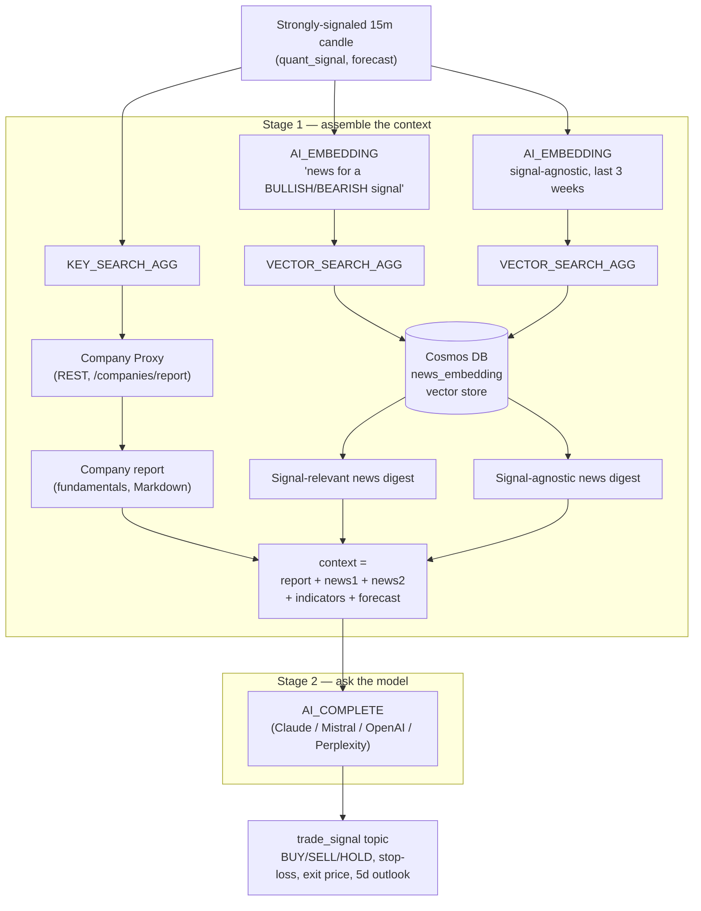

# Building an AI Trading Bot on Confluent Cloud — Part 1: The Event-Driven Foundation

*How Flink SQL turns a flood of news, tweets, filings, and ticks into an AI-ready stream — no microservices, no batch jobs, no glue code.*

> **Disclaimer:** This is a personal proof-of-concept built to explore an architecture pattern, not a production trading system and not investment advice. No real capital is deployed based on its output.

## The itch I wanted to scratch

Financial markets are, at their core, an event stream: every tick, every headline, every tweet, every SEC filing is an event with a timestamp, arriving whenever it wants to arrive. Yet most of the AI-powered trading stacks I came across are built the other way around — a batch job pulls data on a schedule, dumps it into a warehouse, a notebook or a microservice calls out to a model, and the result lands somewhere for a human (or a cron job) to pick up later.

I wanted to see how far I could push the opposite approach: keep the *entire* pipeline — ingestion, cleaning, sentiment scoring, embedding, technical analysis, forecasting, and eventually the trading decision itself — as one continuously running, event-driven system, with Confluent Cloud and Apache Flink as the single substrate underneath. No separate feature store to keep in sync, no cron-triggered enrichment service, no "AI microservice" polling a queue.

This first part covers the whole pipeline that lives inside Confluent Cloud: **Collector** and **Processor** — from a dozen messy, unstructured sources all the way to a `trade_signal` event with a direction, a stop-loss, and an exit price, produced by a chain of Flink SQL statements that ends with retrieval-augmented generation against an LLM. All of it is processing — enrichment, scoring, retrieval, inference — entirely in SQL, no external service in the loop. Nothing yet has *decided* to do anything about it. Part 2 covers the actual **Decision** layer: a local AI Agent, living outside Confluent Cloud, that consumes the `trade_signal` topic and decides whether to act — risk-gating, sizing, and pushing orders into the market.

## The shape of the system


Three swimlanes:

- **Collector** — six scrapers (Seeking Alpha, Investing.com, X/Twitter, Reddit, WSJ, Yahoo Finance) plus an Alpaca WebSocket feed for real-time quotes, order-book depth, and stock news, each producing into its own Kafka topic on Confluent Cloud.
- **Processor** — a chain of Flink SQL statements that dedupe, fuse, score, embed, compute technical indicators, forecast, and, in its last step, do retrieval-augmented generation against a vector store and an LLM to produce a `trade_signal`. All of it running continuously inside Confluent Cloud. Covered in full below.
- **Decision** — the AI Agent, living outside Confluent Cloud entirely, that consumes `trade_signal` and turns it into a risk-gated, paper-traded order on a live dashboard. That's the Part 2 story.

## Collector: turning the outside world into topics

Nothing AI-flavored happens here — it's classic Kafka. Six scrapers each write into their own topic (`seeking_news`, `investing_news`, `twitter_posts`, `reddit_posts`, `wsf_articles`, `yahoo_news`), and a WebSocket producer streams Alpaca market data into `stock_news`, `stock_quotes.depth`, and `stock_quotes.realtime`.

The point of this layer is deceptively simple but important: once every source is a Kafka topic, everything downstream — cleaning, joining, scoring, modeling — can be expressed as a *continuous SQL query* instead of a scheduled batch job. That single decision is what makes the rest of the pipeline possible.

## Processor: from raw events to a trade signal, entirely in SQL

This is where it gets interesting. Every step below is a Flink SQL statement running against Confluent Cloud — no external service, no client library, no orchestrator.

### 1. Fusing six sources into one sentiment-scored news stream

Investing.com, Seeking Alpha, WSJ, Reddit (deduplicated and re-assembled from post + comment threads), Twitter, and Alpaca's stock news all land in different shapes. A single `UNION ALL` normalizes them into one shape, and then every row is scored with Flink's built-in `AI_SENTIMENT` function — called exactly like any other SQL function:

```sql
AI_SENTIMENT(
  SUBSTR(title || CHR(10) || content, 1, 600),
  ARRAY[
    'oil','positive','negative','neutral','finance','interest rates','economy',
    'artificial-intelligence','stock market','stock crash','earnings',
    'merge and acquisition','layoffs','regulatory actions','SEC investigation',
    'revenue miss','growth, upgrades, expansion','profit warning', /* ... */
  ]
) AS r
```

Rather than a single positive/negative score, this passes a curated taxonomy of ~30 financially meaningful aspects, and `AI_SENTIMENT` returns a label + confidence score *per aspect*. A `CROSS JOIN UNNEST` explodes that into rows, and a `GROUP BY` re-aggregates them into a `sentiment.analysis ARRAY<ROW<aspect, label, score>>` on the final `news` record. One article can simultaneously score positive on "growth, upgrades, expansion" and negative on "regulatory actions" — a much richer signal than a single polarity score, and it costs nothing beyond a SQL function call inside a stream.

### 2. Structuring entities: the `companies` table

Yahoo Finance doesn't hand back one clean fact per ticker — a single fetch bundles price, valuation ratios, 52-week range, analyst guidance, and aggregated sentiment together, as a pile of loosely-typed, differently-shaped JSON. None of that is directly usable as LLM context on its own. The whole point of the `companies` table is to consolidate all of it into one strongly-typed entity per ticker, so it can later be rendered into a single coherent Markdown **company report** — the report that step 6 drops straight into the RAG prompt sent to the LLM. Structuring the entity here is what makes generating that report downstream a formality instead of a data-wrangling exercise:

```sql
CREATE TABLE `companies` (
  `ticker` STRING,
  `name` STRING,
  `current_price` FLOAT,
  `ratios` ROW<`pe` STRING, `eps` STRING, `dividend_yield` STRING, `beta` STRING>,
  `week_52` ROW<`high` FLOAT, `low` FLOAT>,
  `news` ARRAY<ROW<category, confidence, content, impact_score, keywords, sentiment, source, title, url>>,
  `sentiment` ROW<sentiment_score, confidence, news_count_7d, key_themes, risks, catalysts, sentiment_trend, /* ... */>,
  `analyst_guidance` ARRAY<ROW<analyst_count, eps_estimate, rating, revenue_estimate, /* ... */>>,
  PRIMARY KEY (ticker) NOT ENFORCED
)
DISTRIBUTED BY HASH(ticker) INTO 3 BUCKETS
WITH ('changelog.mode' = 'append', 'key.format' = 'json-registry', 'value.format' = 'json-registry');
```

Two choices are doing the real work here. `PRIMARY KEY (ticker) NOT ENFORCED` makes this an *upsert* table: every fresh Yahoo Finance snapshot for `META` replaces the previous `META` row instead of appending next to it, so at any instant the table holds exactly one current row per ticker — price, ratios, sentiment trend, and analyst guidance, all under one schema, with no separate lookup tables to join at query time. `DISTRIBUTED BY HASH(ticker) INTO 3 BUCKETS` spreads that changelog across buckets by ticker, so lookups and joins by ticker parallelize instead of hammering a single partition. Together they turn `companies` into the canonical, continuously upserted "current state of a company."

That covers reads *inside* Flink, but the RAG step later in this pipeline (step 6) needs to reach a company's state as a synchronous, per-ticker HTTP lookup from *inside* a streaming join, not by scanning the Flink table directly. So the same upsert changelog is also sinked, via Kafka Connect, into a CosmosDB `companies` container — one document per ticker. Sitting in front of that container is a small purpose-built REST proxy (ASP.NET Core) whose `/companies/report` endpoint renders the CosmosDB document into a Markdown company report on the fly. Flink then reads that endpoint straight back in as a REST external table:

```sql
CREATE TABLE companies_report (
  `ticker` STRING,
  `name`   STRING,
  `report` STRING          -- Markdown summary of the whole document
) WITH (
  'connector'       = 'rest',
  'rest.connection' = 'companies_report_connection'  -- -> https://.../companies/report
);
```

which `KEY_SEARCH_AGG` can then join against by ticker inside a lateral join — the "Company Proxy" call step 6 relies on. The round trip — Flink table → Kafka → CosmosDB → REST proxy → Flink external table — turns a continuously upserted table into an on-demand, LLM-ready document, joinable back into the pipeline as if it were just another table.

### 3. Text to vectors, in-stream

News needs to be retrievable by meaning, not just by keyword, for the RAG step described below. `AI_EMBEDDING`, backed by an Azure OpenAI `text-embedding-3-large` deployment, is invoked as a lateral join directly inside the SQL:

```sql
CROSS JOIN LATERAL TABLE(
  AI_EMBEDDING('palantir_embed',
    CONCAT('Date: ', CAST(published_date AS STRING), ' ', full_content)
  )
) AS e(embedding)
```

The resulting `news_embedding` topic is then picked up by a self-managed Kafka Connect worker running the CosmosDB sink connector, which lands each embedded article into Cosmos DB as a vector store. Flink produces the vector; Kafka Connect promotes it into a serving store. The chain from "an article gets published" to "it's searchable by embedding in a vector database" never leaves the event-driven world — there's no batch re-indexing job.

### 4. From ticks to technical signals

Fifteen-minute candles feed a streaming `OVER` window that keeps the trailing 200 candles per symbol and hands four OHLCV arrays to a custom Python UDF:

```sql
ARRAY_AGG(`close`) OVER w AS close_window,
ARRAY_AGG(high)    OVER w AS high_window,
ARRAY_AGG(low)     OVER w AS low_window,
ARRAY_AGG(volume)  OVER w AS volume_window
...
ta_indicators(close_window, high_window, low_window, volume_window) AS ind
```

`ta_indicators` is a plain Python function — SMA, EMA, RSI, MACD, Bollinger Bands, ATR, OBV, ADX, a Sharpe estimate, and a composite signal/strength score — packaged as a Flink artifact and registered with `CREATE FUNCTION ... LANGUAGE PYTHON`. It runs *inside* the same statement as everything else, called like any built-in. That result is joined against order-book depth (best bid/ask spread, aggregated over 1-minute tumbling windows) and filtered down to candles with real volume, a tight spread, and a clear BULLISH/BEARISH signal — cutting the noise before it ever reaches the forecasting and trade-signal stages.

### 5. Forecasting with a foundation model — still just SQL

The last processing step calls `AI_FORECAST`, backed by a time-series foundation model (TTM / TimesFM), as a streaming `OVER` aggregate:

```sql
AI_FORECAST(
  CAST(`close` AS DOUBLE), `$rowtime`,
  JSON_OBJECT('model' VALUE 'ttm', 'minContextSize' VALUE 20,
              'maxContextSize' VALUE 200, 'horizon' VALUE 1, 'rmseWindowSize' VALUE 5)
) OVER (PARTITION BY symbol ORDER BY `$rowtime`
        RANGE BETWEEN UNBOUNDED PRECEDING AND CURRENT ROW) AS forecast_result
```

Flink manages the model's rolling context window itself; `state-ttl` just bounds how long Flink retains the underlying history. The heavy forecast computation is split into its own statement from the indicator/depth join that follows it, so each piece of the pipeline gets its own compute-pool footprint and can scale independently — an operational pattern that matters once you're running a dozen of these statements concurrently.

### 6. Closing the loop: RAG and an LLM turn the signal into a trade call

The `companies` table and the `news_embedding` vector store built in steps 2 and 3 don't just sit there. Every strongly-signaled 15-minute candle coming out of the forecasting stage triggers a two-stage Flink SQL pipeline — still Processor, still nothing but SQL — that turns it into an actual trade call:

**Stage 1 — assemble the context.** For that ticker, `KEY_SEARCH_AGG` performs a synchronous external table lookup — a REST call to a "Company Proxy" — to pull the company's latest fundamentals report, from *inside* a streaming join. Two separate `AI_EMBEDDING` + `VECTOR_SEARCH_AGG` calls then retrieve relevant articles from the Cosmos DB vector store built above: one query phrased around the current technical signal ("news relevant to trading around a BULLISH signal"), and a second, deliberately signal-agnostic query capped to the last three weeks — so a genuinely bad headline can't get buried just because it doesn't happen to echo today's indicators. The company report, both news digests, the technical indicators, and the forecast are all concatenated into one structured prompt.

**Stage 2 — ask the model.** That prompt goes to `AI_COMPLETE` against an LLM behind a system prompt that pins the response to strict JSON: a `BUY/SELL/HOLD` signal, a stop-loss, an exit price, and a 5-day outlook. The model behind the connection is swappable — Claude, Mistral, OpenAI, or Perplexity can all sit behind the same `CREATE MODEL` definition. The result lands in a `trade_signal` topic.



### What actually comes out the other end

Every layer of the pipeline leaves a fingerprint on the final event, so a single `trade_signal` row doubles as a receipt for the whole architecture:

| Field(s) | Produced by | What it carries |
|---|---|---|
| `symbol`, `window_start`, `window_end` | `stock_quotes.candles_15m` | which stock, which 15-minute bar |
| `open`, `high`, `low`, `close`, `volume`, `volume_ticks` | raw candle | the bar's OHLCV |
| `sma`, `ema`, `rsi`, `macd`, `macd_signal`, `macd_hist`, `bb_lower/mid/upper`, `atr`, `obv`, `adx`, `di_plus`, `di_minus`, `sharpe` | the `ta_indicators` Python UDF | classic technical analysis over the trailing 200 candles |
| `signal_score`, `signal_strength`, `quant_signal` | same UDF | the composite quant read — `BULLISH` / `BEARISH` and its conviction |
| `best_bid`, `best_ask`, `spread` | order-book depth join | live liquidity at that instant |
| `forecast_result` | `AI_FORECAST` (TTM foundation model) | the model's next-step price forecast |
| `context` | `KEY_SEARCH_AGG` (company report) + two `AI_EMBEDDING`/`VECTOR_SEARCH_AGG` retrievals | the full prompt assembled for the LLM: fundamentals, signal-relevant news, signal-agnostic news, indicators, forecast |
| `signal`, `stop_loss`, `exit_price`, `forecast_5d` | `AI_COMPLETE` (the LLM) | the actual decision: direction, risk bounds, and a 5-day qualitative + quantitative outlook |

And here's a real one, live off the pipeline for META (the `context` field is trimmed here — in production it runs to several thousand characters of fundamentals and news):

```json
{
  "symbol": "META",
  "window_start": 1786113000000,
  "window_end": 1786113900000,
  "close": 597.0,
  "volume": 3087979.0,
  "rsi": 72.18,
  "macd": 1.06,
  "adx": 25.63,
  "sharpe": 0.055,
  "signal_score": 8,
  "signal_strength": 100.0,
  "quant_signal": "BULLISH",
  "best_bid": 592.72,
  "best_ask": 593.01,
  "spread": 0.29,
  "forecast_result": {
    "forecast": [{ "timestamp": 1786114808875, "mean": 596.2 }],
    "metadata": "{\"model_name\":\"ttm\",\"pretrained_source\":\"ibm-granite/granite-timeseries-ttm-r2\",\"context_length\":512}"
  },
  "context": "Company: META (Meta Platforms, Inc.)\n\n## Company report\n# Meta Platforms, Inc. (META)\n... [fundamentals, ratios, analyst guidance, 10 recent news items] ...\n\n## Most relevant recent news\nNo recent news available.\n\n## Other company news (independent of the current technical signal)\n- [2026-08-05 / twitter] Analysis of Meta Platforms Inc. ($META)...\n- [2026-08-03 / investing] MSFT vs. META pair trade: Divergence confirmed...\n\n## Technical indicators (15m candle at 2026-08-07 14:30:00)\nclose=597.0, rsi=72.18, macd=1.06, quant_signal=BULLISH (strength=100.0)\n\n## Model forecast (next step)\n([(2026-08-07 15:00:08.875, 596.2, NULL, NULL, NULL)], {...})",
  "signal": "BUY",
  "stop_loss": 588.0,
  "exit_price": 610.0,
  "forecast_5d": "[{\"day\":1,\"expected_close\":596.2,\"outlook\":\"Bullish momentum may pause after the sharp intraday rise and elevated RSI.\"},{\"day\":5,\"expected_close\":607.0,\"outlook\":\"Constructive sentiment and strong technical momentum support further gains, though volatility remains elevated.\"}]"
}
```

Notice what the LLM actually did here: the quant side was screaming `BULLISH` at maximum strength (RSI over 70, MACD rising, a fresh 15-minute high), but the assembled context also surfaced a $567M child-safety court penalty and a "where will META be in 5 years" bear piece sitting right next to the bullish AI-pricing coverage. The model still came back `BUY`, but with a stop-loss just below the day's structure (588) rather than no risk bound at all, and a 5-day outlook that explicitly flags the elevated RSI as a reason near-term momentum might pause before resuming. That's the whole point of routing the technical signal through an LLM with retrieved context instead of acting on `quant_signal` directly — the decision reflects the trend *and* the news sitting on top of it, not either one alone.

One detail worth calling out on its own: calling a non-deterministic function like an LLM only works on a genuinely insert-only Flink stream — the engine blocks non-deterministic functions on *any* updating changelog, even an upsert stream with a clean key. Getting there meant reshaping the whole context-assembly query to stay append-only end to end: `stock_quotes.analysis_forecast` gets altered to `append` mode, and both news retrievals build their summaries by indexing straight into the `VECTOR_SEARCH_AGG` result array (`hits[1]` … `hits[N]`) instead of `CROSS JOIN UNNEST` + `GROUP BY`/`ARRAY_AGG` — an unbounded `GroupAggregate` always emits update-before/update-after messages as rows accumulate into a group, regardless of the source's changelog mode, which would otherwise poison the stream feeding `AI_COMPLETE`. It's a good example of how much changelog semantics start to matter the moment AI inference joins a streaming pipeline: the model call didn't just need a prompt, it needed the *entire upstream query* to be provably a fact stream, not a running total.

## Why Flink SQL is the meeting point

Stepping back, a few things stood out building this that I think are the real story here:

- **Model inference is a SQL primitive.** `AI_SENTIMENT`, `AI_EMBEDDING`, `AI_FORECAST`, and `AI_COMPLETE` aren't external calls bolted on with client SDKs and retry logic — they're functions and lateral table functions you call inside a `SELECT`, right next to `CAST` and `ARRAY_AGG`. The event-driven pipeline and the AI inference step are the same statement.
- **Bring-your-own-model sits next to built-in AI.** The technical-indicator UDF is ordinary Python, registered as a Flink artifact, called exactly like `AI_FORECAST` next to it. Classic quant logic and foundation models coexist in the same query without one being "the real pipeline" and the other "the AI bolt-on."
- **Retrieval-augmented generation is just more joins.** `KEY_SEARCH_AGG` for a synchronous REST lookup, `VECTOR_SEARCH_AGG` for semantic search, `AI_COMPLETE` for the actual model call — RAG, arguably the canonical "AI meets infrastructure" problem, turns out to be a lateral join chain inside a single `INSERT INTO`, no orchestration framework required.
- **State is a first-class, tunable resource.** A 200-row `OVER` window gives you rolling technical-indicator context for free; a `state-ttl` of a few days bounds how much history `AI_FORECAST` carries without a separate feature store. Declaring `changelog.mode` (`append` vs `upsert`) up front forces you to be explicit about whether a row is an immutable fact or a running total — which is exactly the kind of ambiguity that normally leaks into bugs later, and exactly what makes or breaks feeding a non-deterministic model call downstream.
- **CDC-out closes the loop without breaking the chain.** The vector database isn't a separate system to keep in sync — it's a Kafka Connect sink reading a Flink-produced topic. The event-driven world and the serving layer stay connected by the same log.

## What's next — Part 2: the AI Agent that acts on it

Everything so far — Collector and Processor — runs as continuous SQL inside Confluent Cloud, and it stops at `trade_signal`: a well-reasoned, LLM-generated `BUY/SELL/HOLD` with a stop-loss and an exit price, sitting in a Kafka topic. On purpose, nothing in this pipeline places an order — Processor's job ends at *reasoning about* a trade, not *taking* one.

That's what the Decision layer is for, and it's deliberately not another Flink SQL statement: a local AI Agent, living outside Confluent Cloud, that consumes `stock_quotes.trade_signal` and decides what, if anything, to actually do about it. Per the architecture, that means an agent framework wrapping the signal in risk gating and a circuit breaker, portfolio management to size the position against what's already held, a couple of supplementary ML predictors (XGBoost, LSTM) as an extra sanity check before committing capital, and paper-trading execution against the Alpaca API — all surfaced on a live Streamlit dashboard.

The interesting question for Part 2 isn't "how do you call a broker API" — it's why that logic belongs in a regular application instead of another Flink SQL statement once the pipeline crosses from *reasoning about* a trade into *taking* one, and what it takes for that hand-off to stay just as event-driven as everything upstream: the agent's only input is a Kafka topic, no polling, no batch reconciliation job.
